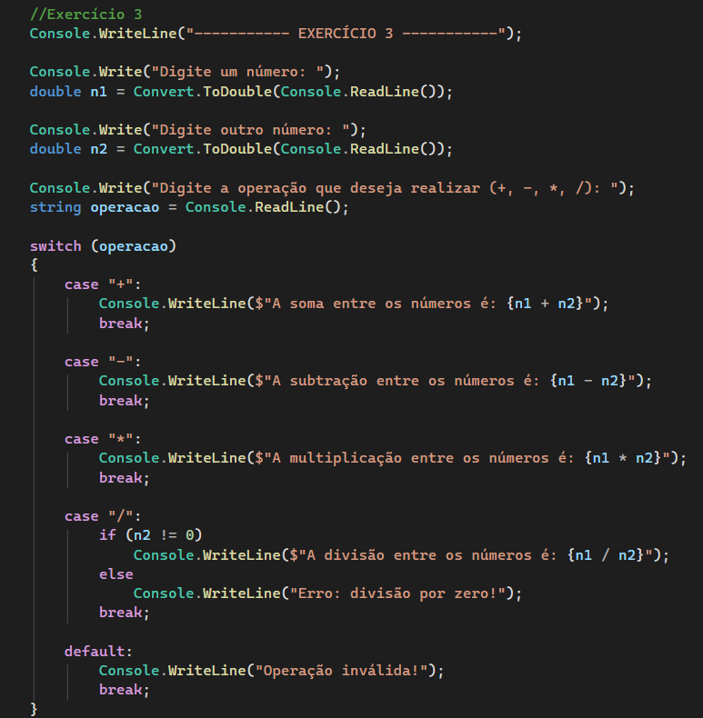
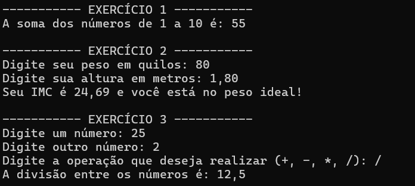

# 🚀 Desafios C# - UPPER

Projeto desenvolvido em **C#** utilizando **Console Application**, com foco em lógica de programação, estruturação de código e resolução de desafios práticos.

---

## 🧠 Tecnologias utilizadas

- C#
- .NET Framework
- Visual Studio

## 📸 Demonstração

### 💻 Código do projeto

---

### 🖥️ Execução no console

---

## 🎯 Objetivo

Este projeto foi desenvolvido com o objetivo de praticar:

- Estruturas condicionais
- Lógica de programação
- Organização de código
- Desenvolvimento em C#
- Aplicações Console

---

## 📚 Aprendizados

Durante o desenvolvimento deste projeto, foram reforçados conceitos importantes da programação utilizando C#, além da prática na resolução de problemas e estruturação de aplicações console.

---

## 👨‍💻 Desenvolvedor/Aluno

Gabriel Costa Domiciano

📎 LinkedIn:  
[LinkedIn - Gabriel Costa Domiciano](https://www.linkedin.com/in/gabriel-costa-domiciano-a18a2a325/)
